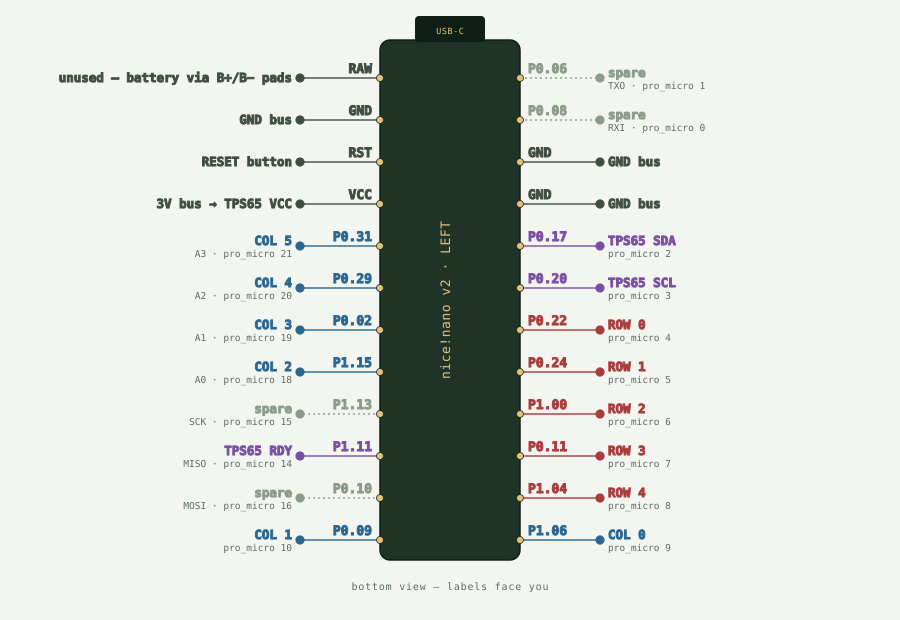
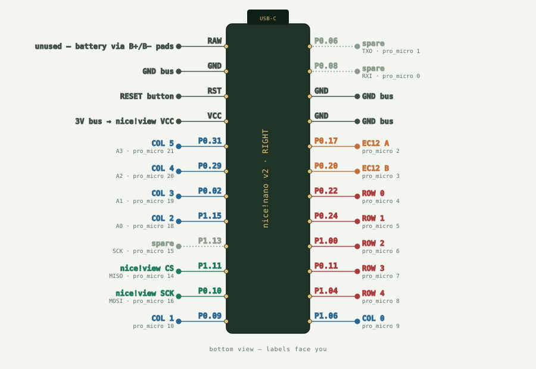

# SlabBoard wiring reference

Hand-wiring pinouts for the two nice!nano v2 halves. Pins are named as they are
silkscreened on the board — raw nRF52840 port names (`P0.22`, `P1.15`), not Pro
Micro D-numbers.

### 📌 Manufacturer's pinout

**[nice!nano v2 official pinout → `pinout-v2.png`](https://nicekeyboards.com/static/1788ac663060fd510f4894b286cd97b1/3c492/pinout-v2.png)** — nicekeyboards' own
drawing, and the authority on what each pad is. The diagrams here are redrawn to
show *this keyboard's* signal assignments on top of that pinout; they do not
replace it. Open both side by side before soldering, and if they ever disagree,
the manufacturer's wins.

> **Both diagrams are drawn from the BOTTOM of the board.** The nice!nano prints
> its pin labels on the underside, so this is the face you read while soldering.
> To line a board up: labels facing you, USB-C pointing away. RAW then falls on
> the left and `P0.06` on the right. From the component side, mirror everything
> left-to-right.

`wiring-diagram.html` in this folder is the full interactive page, including the
diode/matrix schematic and the battery, switch and reset wiring. GitHub shows
HTML as source rather than rendering it, so download it and open it in a browser.

## Legend

| Colour | Signal |
|---|---|
| 🔴 red | matrix row |
| 🔵 blue | matrix column |
| 🟣 purple | I²C — trackpad |
| 🟢 green | SPI — display |
| 🟠 orange | encoder |
| ⚫ dark | power / reset / ground |
| ⚪ grey (dashed) | spare, unused |

## Left half — BLE central

## Right half — encoder and display

## Pin tables

### Key matrix — 5 × 6 per half, `col2row`

| Net | Silkscreen | ZMK devicetree |
|---|---|---|
| ROW 0 | `P0.22` | `&gpio0 22` |
| ROW 1 | `P0.24` | `&gpio0 24` |
| ROW 2 | `P1.00` | `&gpio1 0` |
| ROW 3 | `P0.11` | `&gpio0 11` |
| ROW 4 | `P1.04` | `&gpio1 4` |
| COL 0 | `P1.06` | `&gpio1 6` |
| COL 1 | `P0.09` | `&gpio0 9` |
| COL 2 | `P1.15` | `&gpio1 15` |
| COL 3 | `P0.02` | `&gpio0 2` |
| COL 4 | `P0.29` | `&gpio0 29` |
| COL 5 | `P0.31` | `&gpio0 31` |

Both halves use the same pins. The right half lists its columns in reverse, with
`col-offset = <6>`, because the halves are mirror images — COL 6 is the inner
index column, COL 11 the outer pinky.

### nice!view display — right half

| Pad | Silkscreen |
|---|---|
| VCC | VCC |
| GND | GND |
| SCK | `P0.10` |
| MOSI | `P1.01` — inner through-hole |
| CS | `P1.11` |

The nice!view is a Sharp memory-in-pixel LCD (`sharp,ls0xx`). It takes
chip-select, clock and data only — **there is no D/C line to wire.**

### EC12 rotary encoder — right half

| Leg | Silkscreen |
|---|---|
| A | `P0.17` |
| B | `P0.20` |
| C (common) | GND |
| SW leg 1 | `P1.02` — inner through-hole |
| SW leg 2 | GND |

The push switch is not in the firmware yet: the 5×6 grid is full, so it needs a
`zmk,kscan-gpio-direct` plus `kscan-composite` and a 61st keymap position.

### Azoteq TPS65 trackpad — left half

| Pad | Silkscreen |
|---|---|
| VCC | VCC |
| GND | GND |
| SDA | `P0.17` |
| SCL | `P0.20` |
| RDY | `P1.11` |

Driven by [AYM1607/zmk-driver-azoteq-iqs5xx](https://github.com/AYM1607/zmk-driver-azoteq-iqs5xx), an external ZMK module pulled in by `config/west.yml`. The pad
sits at I²C address `0x74` on `i2c0`. No reset line is wired — the driver treats
`reset-gpios` as optional.

### Power and reset — both halves

| Function | Pad |
|---|---|
| Battery +/− | `B+` / `B−` — small holes |
| On/off switch | inline on the battery's positive lead |
| Reset button | RST → GND |

## Before you solder

- **Verify the silkscreen against your own boards** and against the
  [official pinout](https://nicekeyboards.com/static/1788ac663060fd510f4894b286cd97b1/3c492/pinout-v2.png). Clones and older revisions have shipped with shifted
  or mislabelled pads. Beep out a pin or two first.
- **`P0.09` and `P0.10` are the nRF52840's NFC pins.** They only work as GPIO with
  `CONFIG_NFCT_PINS_AS_GPIO=y`, which ZMK's nice!nano board definition sets.
  `P0.09` is COL 1 and `P0.10` is the display clock, so both halves depend on it.
- **Two signals land on the inner holes** (`P1.01`, `P1.02`) because the 18-pin
  edge header is fully committed. `P1.01`, `P1.02` and `P1.07` are ordinary plated
  through-holes, the same size as the header ones — they just sit inboard of the two
  edge rows instead of on them, so solder them exactly like any other pin. The small
  square SWD/SWC contacts beside them *are* surface pads, for programming; leave them.
- **EC12 leg order varies by part.** Confirm the shared common with a continuity
  beep before soldering.
- **Thick battery wire will not fit `B+`/`B−`.** Those two holes are smaller than
  the header ones. You do not have to thread the wire through: tin the ring around
  the hole, tin the lead, and solder the wire flat against it, then anchor the wire
  so nothing tugs the joint. Cleaner still, solder a short thin pigtail to the hole
  and splice the thicker lead to that under heat-shrink. Current here is small — the
  charger runs around 100 mA and the keyboard idles in the tens — so a thin conductor
  costs nothing.
- **Diode direction must be consistent across all 60 keys** and must match
  `diode-direction = "col2row"` in the shield, or nothing will register.
