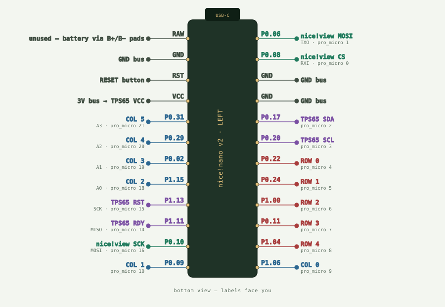
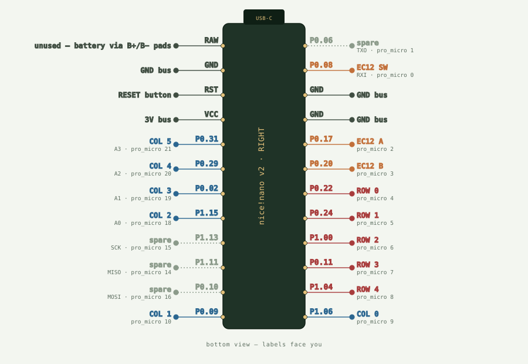

# SlabBoard wiring reference

> ### ⚠ Revision 2 — differs from the built prototype
>
> **The nice!view has moved from the right half to the left.** A split peripheral
> cannot show a layer indicator: ZMK's split link carries key-position, sensor,
> input and battery events from peripheral to central, and only behaviour
> invocation and HID indicators back the other way. Layer state never crosses it,
> so the display has to live on the central half — which is the left.
>
> **The EC12 push switch has moved off the `P1.02` inner hole onto `P0.08`.** It never
> needed to be on an inner hole: `P0.06` and `P0.08` were spare on the right half in
> revision 1 too. Revision 2 uses edge-header pins only, on both halves.
>
> **The firmware in this repository still builds the display on the right (revision 1),
> and does not implement the encoder switch at all.** Do not wire the prototype from
> this page. `config/` and `docs/` deliberately disagree until revision 2 is built.

For the key layout rather than the wiring, see [`keymap.md`](keymap.md). For an
input device evaluated and **deferred** to a future build, see
[`future-ano-build.md`](future-ano-build.md) — it describes no part of this keyboard.

Hand-wiring pinouts for the two nice!nano v2 halves. Pins are named as they are
silkscreened on the board — raw nRF52840 port names (`P0.22`, `P1.15`), not Pro
Micro D-numbers.

### 📌 Manufacturer's pinout

**[nice!nano v2 official pinout → `pinout-v2.png`](https://nicekeyboards.com/static/1788ac663060fd510f4894b286cd97b1/3c492/pinout-v2.png)** — nicekeyboards' own
drawing, and the authority on what each pad is. The diagrams here are redrawn to
show *this keyboard's* signal assignments on top of that pinout; they do not
replace it. Open both side by side before soldering, and if they ever disagree,
the manufacturer's wins.

> **Both diagrams are drawn from the BOTTOM of the board.** The nice!nano prints
> its pin labels on the underside, so this is the face you read while soldering.
> To line a board up: labels facing you, USB-C pointing away. RAW then falls on
> the left and `P0.06` on the right. From the component side, mirror everything
> left-to-right.

`wiring-diagram.html` in this folder is the full interactive page, including the
diode/matrix schematic and the battery, switch and reset wiring. GitHub shows
HTML as source rather than rendering it, so download it and open it in a browser.

## Legend

| Colour | Signal |
|---|---|
| 🔴 red | matrix row |
| 🔵 blue | matrix column |
| 🟣 purple | I²C — trackpad |
| 🟢 green | SPI — display |
| 🟠 orange | encoder |
| ⚫ dark | power / reset / ground |
| ⚪ grey (dashed) | spare, unused |

## Left half — BLE central

## Right half — encoder and display

## Pin tables

### Key matrix — 5 × 6 per half, `col2row`

| Net | Silkscreen | ZMK devicetree |
|---|---|---|
| ROW 0 | `P0.22` | `&gpio0 22` |
| ROW 1 | `P0.24` | `&gpio0 24` |
| ROW 2 | `P1.00` | `&gpio1 0` |
| ROW 3 | `P0.11` | `&gpio0 11` |
| ROW 4 | `P1.04` | `&gpio1 4` |
| COL 0 | `P1.06` | `&gpio1 6` |
| COL 1 | `P0.09` | `&gpio0 9` |
| COL 2 | `P1.15` | `&gpio1 15` |
| COL 3 | `P0.02` | `&gpio0 2` |
| COL 4 | `P0.29` | `&gpio0 29` |
| COL 5 | `P0.31` | `&gpio0 31` |

Both halves use the same six column pins, but the **left** half lists them reversed.
The halves are mirror images: `P1.06` is the inner (index) column and `P0.31` the
outer (pinky) column on each. Keymap columns run left to right across the whole
board, so the outer pinky is COL 0 on the left and COL 11 on the right. Confirmed by
flashing both halves.

### nice!view display — left half *(revision 2)*

| Pad | Silkscreen |
|---|---|
| VCC | VCC |
| GND | GND |
| SCK | `P0.10` |
| MOSI | `P0.06` |
| CS | `P0.08` |

All three signals land on edge-header pins here, so revision 2 needs no inner
through-hole for the display.

This fills the left half's last three free header pins. After this it is fully
committed: 18 of 18, with the `P1.01`, `P1.02` and `P1.07` inner through-holes
the only GPIO left on that half.

The nice!view is a Sharp memory-in-pixel LCD (`sharp,ls0xx`). It takes
chip-select, clock and data only — **there is no D/C line to wire.**

### EC12 rotary encoder — right half

| Leg | Silkscreen |
|---|---|
| A | `P0.17` |
| B | `P0.20` |
| C (common) | GND |
| SW leg 1 | `P0.08` |
| SW leg 2 | GND |

`P0.08` sits three positions above `P0.17` in the same column, so the encoder's whole
harness — SW, its GND leg, the common GND leg, A and B — lands in one contiguous run.

Revision 1 put this switch on the `P1.02` inner through-hole on the mistaken grounds
that the right half's header was full. It was not: with the matrix and the encoder's A
and B wired, the right half used 15 of 18 header pins and `P1.13`, `P0.06` and `P0.08`
were all free. Revision 2 corrects that. Moving the display off this half is what makes
the count comfortable rather than what makes it possible — with the switch on `P0.08`,
the right half uses 14 of 18 and leaves `P1.13`, `P1.11`, `P0.10` and `P0.06` spare.

The push switch is not in the firmware yet: the 5×6 grid is full, so it needs a
`zmk,kscan-gpio-direct` plus `kscan-composite` and a 61st keymap position. Wiring it
costs nothing if it stays unbound.

### Azoteq TPS65 trackpad — left half

Pads listed in silkscreen order, top to bottom, as they appear on the Azoteq board.
Note it has no pad called VCC — `3V3` **is** the supply, and the nice!nano's `VCC`
pin is its regulated 3.3 V rail, so those two connect together.

| Azoteq pad | nice!nano |
|---|---|
| RDY | `P1.11` |
| RST | `P1.13` |
| GND | any GND |
| **3V3** | **`VCC`** |
| SCL | `P0.20` |
| SDA | `P0.17` |

`SCL` and `SDA` are the last two pads and easy to transpose — **SDA is `P0.17`,
SCL is `P0.20`**. Swapped, the bus is simply dead with no other symptom.

`GND` and `3V3` are adjacent pads; check continuity between them reads open before
powering up.

The IQS5xx runs at 1.65–3.6 V, so nothing on this board should ever see 5 V. Confirm
the breakout has I²C pull-ups on SDA/SCL — Azoteq's own boards normally do. If not,
fit 4.7 kΩ from each line to 3.3 V, since the bus is configured for 400 kHz.

Driven by [AYM1607/zmk-driver-azoteq-iqs5xx](https://github.com/AYM1607/zmk-driver-azoteq-iqs5xx), an external ZMK module pulled in by `config/west.yml`. The pad
sits at I²C address `0x74` on `i2c0`. No reset line is wired — the driver treats
`reset-gpios` as optional.

### Power and reset — both halves

| Function | Pad |
|---|---|
| Battery +/− | `B+` / `B−` — small holes |
| On/off switch | inline on the battery's positive lead |
| Reset button | RST → GND |

## Before you solder

- **Verify the silkscreen against your own boards** and against the
  [official pinout](https://nicekeyboards.com/static/1788ac663060fd510f4894b286cd97b1/3c492/pinout-v2.png). Clones and older revisions have shipped with shifted
  or mislabelled pads. Beep out a pin or two first.
- **`P0.09` and `P0.10` are the nRF52840's NFC pins.** They only work as GPIO with
  `CONFIG_NFCT_PINS_AS_GPIO=y`, which ZMK's nice!nano board definition sets.
  `P0.09` is COL 1 and `P0.10` is the display clock, so both halves depend on it.
- **Revision 2 uses edge-header pins only.** Revision 1 pushed nice!view MOSI to
  `P1.01` and the encoder switch to `P1.02`; neither had to go there, since `P0.06` and
  `P0.08` were spare on that half. Both are on header pins now, and `P1.01`, `P1.02`
  and `P1.07` stay spare. They are ordinary plated through-holes, the same size as the
  header ones — they just sit inboard of the two edge rows instead of on them, so
  solder them exactly like any other pin if you do use them. The small square SWD/SWC
  contacts beside them *are* surface pads, for programming; leave them.
- **EC12 leg order varies by part.** Confirm the shared common with a continuity
  beep before soldering.
- **Thick battery wire will not fit `B+`/`B−`.** Those two holes are smaller than
  the header ones. You do not have to thread the wire through: tin the ring around
  the hole, tin the lead, and solder the wire flat against it, then anchor the wire
  so nothing tugs the joint. Cleaner still, solder a short thin pigtail to the hole
  and splice the thicker lead to that under heat-shrink. Current here is small — the
  charger runs around 100 mA and the keyboard idles in the tens — so a thin conductor
  costs nothing.
- **Diode direction must be consistent across all 60 keys** and must match
  `diode-direction = "col2row"` in the shield, or nothing will register.
